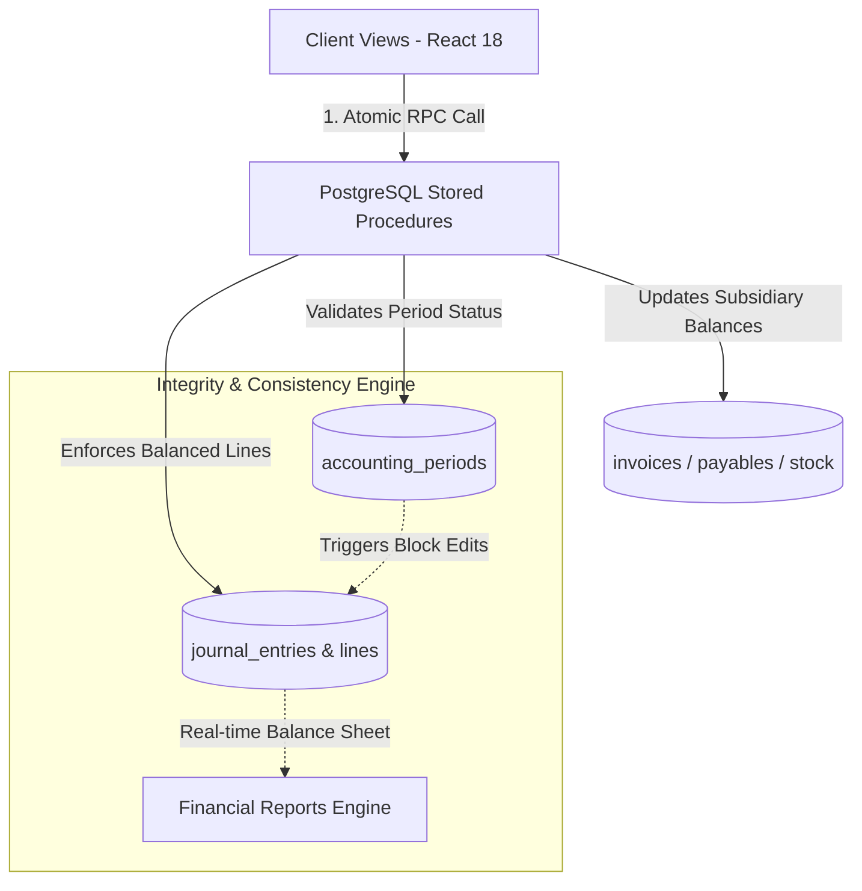

# AT-ERP Comprehensive Accounting & System Architecture Audit Report

**Audit Date:** September 3, 2026  
**Auditor Roles:** Senior Certified Public Accountant (CPA) & Expert Enterprise Systems Architect  
**Subject System:** AT-ERP (React 18 + TypeScript + Vite + Supabase PostgreSQL)  
**Target Scope:** General Ledger, Financial Reporting, Accounts Receivable (AR), Accounts Payable (AP), Inventory Accounting, Payroll & Statutory Deductions, Period Closing Controls, System Architecture & Data Integrity.

---

## 1. Executive Summary

An exhaustive, forensic audit was conducted on the AT-ERP institutional enterprise codebase. The review encompassed financial logic integrity, compliance with Generally Accepted Accounting Principles (GAAP/IFRS/PFRS), Philippine tax/labor statutory rules (BIR, SSS, PhilHealth, Pag-IBIG, DOLE), database constraints, atomic transaction management, and React/PostgreSQL architecture.

While AT-ERP possesses rich features and sophisticated domain coverage (such as tiered sponsor billing, student portals, and PostgreSQL stored procedures for AP and Payment allocations), **several critical accounting and architectural vulnerabilities were identified**. Left unaddressed, these issues will result in unbalanced balance sheets, corrupted audit trails, orphaned ledger entries during network disruptions, unauthorized postings to closed accounting periods, and discrepancies with tax authorities.

---

## 2. Summary of Audit Findings Matrix

| Ref # | Category | Finding Description | Severity | Risk Level |
|---|---|---|---|---|
| **F-01** | Financial Statements | Balance Sheet fails fundamental equation ($Assets \ne Liabilities + Equity$) due to omitted Current Period Net Income | Critical | High |
| **F-02** | Period Closing | Period lock controls bypassed; system falls back to `HARD_CLOSE` and `LOCKED` periods when posting invoices | Critical | High |
| **F-03** | Audit Trail / GL | Soft-deletion (`is_deleted: true`) allowed on posted journal entries without reversal vouchers | Critical | High |
| **F-04** | Fixed Assets / GL | Asset depreciation posts in-memory only, leaves `accountId` blank, credits Asset instead of Accumulated Depreciation | High | High |
| **F-05** | Payroll / GL | Missing deductions account filters out journal credit line, resulting in unbalanced debits vs credits | High | High |
| **F-06** | Accounts Receivable | Payment applications inherit original invoice `periodId` regardless of actual payment application date | High | High |
| **F-07** | Inventory / GL | Goods Receipt GL posting fails silently due to schema property typo (`accountClass` instead of `class`) | High | High |
| **F-08** | Inventory Accounting | `InventoryGLService` uses COGS expense account as inventory asset account, and transfer entries self-cancel | High | Medium |
| **F-09** | Accounts Payable | Disconnected AP disbursement flow in `APView` posts ad-hoc journals without updating bill balances or status | High | High |
| **F-10** | System Architecture | Non-atomic dual-write REST requests for journal header and lines create orphaned/unbalanced records on failure | Critical | High |
| **F-11** | Statutory Compliance | All payroll deductions grouped into generic accrued liability without employer matching contributions | Medium | Medium |
| **F-12** | Financial Logic | Hardcoded account code prefixes (`11`, `15`, `4000`, `2200`) prevent Chart of Accounts flexibility | Medium | Medium |

---

## 3. Deep-Dive Audit Findings & Technical Evidence

### F-01: Balance Sheet Fundamental Accounting Equation Failure
- **Location:** `accountingService.ts` (`generateBalanceSheet`), `views/Reports.tsx` (Lines 105–108, 924–930).
- **The Accounting Principle:** Under double-entry accrual accounting, the fundamental balance sheet equation is:
  $$\text{Total Assets} = \text{Total Liabilities} + \text{Total Equity}$$
  Where Total Equity **must** include Retained Earnings / Current Period Net Income ($\text{Revenues} - \text{Expenses}$).
- **The Finding:** `generateBalanceSheet` calculates:
  ```typescript
  const totalAssets = assets.reduce((sum, s) => sum + s.balance, 0);
  const totalLiabilities = liabilities.reduce((sum, s) => sum + s.balance, 0);
  const totalEquity = equity.reduce((sum, s) => sum + s.balance, 0);
  ```
  And in `views/Reports.tsx`:
  ```tsx
  {formatCurrency(bs.totalLiabilities + bs.totalEquity)}
  ```
  Current period net income is completely omitted from Equity. Unless a manual closing entry is posted after every transaction, the Balance Sheet will **never balance**. For instance, if an institution earns ₱500,000 in tuition revenue paid in cash: Assets increase by ₱500,000, Liabilities = ₱0, Equity = ₱0. Reported Assets (₱500,000) $\ne$ Liabilities + Equity (₱0).
- **Corrective Action:** Dynamically compute Current Period Net Income ($\text{Total Revenue} - \text{Total Expenses}$) and present it as an explicit line item under Owner's Equity ("Current Year Earnings / Net Income") before period close.

---

### F-02: Period Lock Controls Bypassed & Fallback to Closed/Locked Periods
- **Location:** `App.tsx` (`resolvePostingPeriodId`, `resolveInvoiceFallbackPeriodId`, Lines 1779–1830).
- **The Accounting Principle:** A closed or locked period is immutable under statutory and tax accounting. No transaction can be posted, backdated, or modified in a `HARD_CLOSE` or `LOCKED` period without an explicit audit-logged administrative unlock.
- **The Finding:** 
  1. In `resolveInvoiceFallbackPeriodId`:
     ```typescript
     const pickByPriority = (periods: typeof orgPeriods) =>
       periods.find(p => p.status === 'OPEN') ||
       periods.find(p => p.status === 'SOFT_CLOSE') ||
       periods.find(p => p.status === 'HARD_CLOSE') ||
       periods.find(p => p.status === 'LOCKED') ||
       null;
     ```
     If an organization has not yet created a new open period, the invoice posting logic deliberately falls back to selecting a `HARD_CLOSE` or `LOCKED` period.
  2. In `resolvePostingPeriodId`:
     ```typescript
     if (explicitPeriodId && orgPeriods.some(p => p.id === explicitPeriodId)) {
       return explicitPeriodId;
     }
     ```
     If an `explicitPeriodId` is supplied, it is returned without checking whether that period is `HARD_CLOSE` or `LOCKED`.
- **Corrective Action:** Eliminate the fallback to `HARD_CLOSE` and `LOCKED`. Immediately abort posting with a clear error: `"Cannot post transaction: No open accounting period exists for date [date]. Please open the required period."` Add PostgreSQL table triggers on `journal_entries` preventing insert/update when the target period is not open.

---

### F-03: Soft-Deletion of Posted Journal Entries
- **Location:** `services/SupabaseDataService.ts` (`deleteJournalEntry`, Line 5115).
- **The Accounting Principle:** Under GAAP/IFRS and BIR regulations, **posted accounting records cannot be deleted**. Deleting a posted entry breaks auditability and destroys sequential document numbering. The only legal remedy for an erroneous entry is a formal **Reversal Entry** (`sourceType: 'REVERSAL'`) with an audit reason and timestamp.
- **The Finding:** `deleteJournalEntry` performs a `PATCH` on `journal_entries`:
  ```typescript
  body: JSON.stringify({ is_deleted: true, deleted_at: new Date().toISOString() })
  ```
  It does not verify whether the entry is `POSTED`, does not check if the accounting period is locked, and does not soft-delete or clear the associated `journal_lines`, leaving orphaned line items in the database.
- **Corrective Action:** Disable `deleteJournalEntry` for any entry where `status === 'POSTED'`. Restrict voiding/corrections strictly to `reverseJournalEntry`.

---

### F-04: Fixed Assets Depreciation Logic and Volatility
- **Location:** `App.tsx` (`handleDepreciate`, Lines 4460–4510), `views/AssetsView.tsx`.
- **The Accounting Principle:** Straight-line asset depreciation requires:
  - Debit: Depreciation Expense (Operating Expense)
  - Credit: Accumulated Depreciation (Contra-Asset)
- **The Finding:** 
  1. The debit line is created with an empty account:
     ```typescript
     accountId: '', // Depreciation expense account-will use blank for now
     ```
  2. The credit line directly credits the Fixed Asset cost account (`asset.glAccountId`) rather than Accumulated Depreciation, distorting historical equipment cost basis on the balance sheet.
  3. The entry is never sent to `dataService.createJournalEntry` or `handlePostJournal`; it is only added to React local component state:
     ```typescript
     setJournalEntries(prev => [...prev, newEntry]);
     setJournalLines(prev => [...prev, ...newLines]);
     ```
     Upon browser refresh, the depreciation entry completely vanishes from the database while the asset's `accumulatedDepreciation` field remains incremented.
- **Corrective Action:** Map a dedicated `depreciationExpenseAccountId` and `accumulatedDepreciationAccountId`. Call `handlePostJournal` atomically to persist both header and lines to Supabase.

---

### F-05: Payroll Journal Deductions Account Omission & Unbalanced Ledger
- **Location:** `views/PayrollView.tsx` (Lines 216–220), `App.tsx` (`handlePostPayroll`, Lines 414–418).
- **The Accounting Principle:** Total Debits must equal Total Credits before any journal can be submitted. Gross Pay (Debit) = Net Pay (Credit to Cash) + Statutory Deductions (Credit to Taxes/Benefits Payable).
- **The Finding:** 
  In `views/PayrollView.tsx`:
  ```typescript
  const taxPayId = accounts.find(a => a.name.includes('Accrued Payroll'))?.id;
  const journalLines: JournalLine[] = [
    { accountId: salariesExpId, debit: gross, credit: 0 },
    { accountId: bank.glAccountId, debit: 0, credit: net },
    { accountId: taxPayId || '', debit: 0, credit: depr }
  ].filter(l => l.accountId !== '');
  ```
  If the Chart of Accounts does not have an account matching `"Accrued Payroll"`, `taxPayId` is undefined, and line 3 is filtered out. The resulting entry has Debit = Gross Pay (e.g., ₱100,000) and Credit = Net Pay (e.g., ₱80,000). Debits $\ne$ Credits.
  Furthermore, in `App.tsx` (`handlePostPayroll`):
  ```typescript
  } catch (error) {
    // Fallback: At least update local state even if Supabase fails
    setPayrollRuns(prev => [...prev, run as PayrollRun]);
    setPayrollLines(prev => [...prev, ...lines as PayrollLine[]]);
    handlePostJournal(entry, entryLines);
  }
  ```
  If saving the payroll run fails, it catches the error and **still posts the journal entry to the GL**, causing a permanent desynchronization between payroll records and GL balances.
- **Corrective Action:** Validate that dedicated payroll liability accounts (WTAX Payable, SSS Payable, PhilHealth Payable, Pag-IBIG Payable) exist prior to allowing payroll generation. Never proceed to post the journal entry if persisting the payroll record failed.

---

### F-06: Payment Application Cross-Period Contamination
- **Location:** `App.tsx` (`handleApplyPayment`, Lines 6001–6012).
- **The Accounting Principle:** When an existing customer deposit/payment is applied against an invoice, the accounting recognition date is the date the application took place, and the entry must belong to the accounting period covering that application date.
- **The Finding:**
  ```typescript
  const applEntry: Partial<JournalEntry> = {
    periodId: invoice.periodId || '',
    date: new Date().toISOString().split('T')[0],
    sourceType: 'APPLICATION',
    sourceRef: savedApplication.id,
  };
  ```
  If an invoice was billed in January (Period 1) and the payment is applied in March (Period 3), `applEntry` receives `periodId: invoice.periodId` (January). Because `resolvePostingPeriodId` accepts any existing explicit period ID without date validation, this transaction is posted into January's closed ledger, retroactively altering closed historical balances.
- **Corrective Action:** Resolve `periodId` based on `applEntry.date` (the application date), not the invoice's historical period.

---

### F-07: Broken Goods Receipt Posting (Schema Typo Bug)
- **Location:** `views/GoodsReceiptView.tsx` (Lines 205–212).
- **The Finding:**
  ```typescript
  const inventoryAccount = accounts.find(a =>
    a.name.toLowerCase().includes('inventory') && a.accountClass === 'ASSET'
  );
  const grirAccount = accounts.find(a =>
    a.name.toLowerCase().includes('gr/ir') || a.name.toLowerCase().includes('goods receipt')
  ) || accounts.find(a => a.accountClass === 'LIABILITY');
  ```
  The TypeScript interface `ChartOfAccount` declares the property `class: AccountClass`. There is no property named `accountClass` on `ChartOfAccount`. Consequently, `a.accountClass` evaluates to `undefined`, the condition is always false, `inventoryAccount` is undefined, and `onPostJournal` is **silently bypassed**. The user receives a toast notification claiming `"Goods Receipt ... posted. GR/IR Clearing entry created"`, but **no journal entry is ever created**.
- **Corrective Action:** Change `a.accountClass` to `a.class`. Ensure explicit account configuration rather than arbitrary substring searches.

---

### F-08: Inventory GL Misclassification & Self-Balancing Transfers
- **Location:** `services/InventoryGLService.ts` (Lines 40–42, 120–123, 140–160).
- **The Finding:**
  1. In `createAdjustmentEntry` and `createTransferEntry`:
     ```typescript
     const inventoryAccount = item.cogsAccountId 
       ? accounts.find(a => a.id === item.cogsAccountId)
       : accounts.find(a => a.name.toLowerCase().includes('inventory') && a.class === AccountClass.ASSET);
     ```
     `item.cogsAccountId` (Cost of Goods Sold — an **Expense** account) is assigned as the `inventoryAccount` (an **Asset** account). Any inventory adjustments debit or credit COGS instead of Inventory Asset.
  2. In `createTransferEntry`:
     ```typescript
     // Lines debit and credit the exact same inventoryAccount
     { accountId: inventoryAccount.id, debit: transferAmount, credit: 0 },
     { accountId: inventoryAccount.id, debit: 0, credit: transferAmount }
     ```
     Both lines post to the identical GL account. The entry accomplishes nothing other than artificially inflating gross ledger debit and credit turnover.
- **Corrective Action:** Add an explicit `inventoryAssetAccountId` to `StockItem` and `InventoryClass`. Support location-based sub-accounts or transit accounts for inter-warehouse transfers.

---

### F-09: Dual Disconnected Accounts Payable Disbursement Flows
- **Location:** `views/APView.tsx` (`handlePostPayment`, Lines 259–289) vs. `views/PayablesView.tsx` (`postPayablePayment`).
- **The Finding:** 
  The codebase contains two competing screens for vendor payables:
  1. In `views/PayablesView.tsx`, payments invoke `dataService.postPayablePayment()`, which calls the robust PostgreSQL stored procedure `post_payable_payment` (locking rows with `FOR UPDATE`, updating `paid_amount`, and closing payables).
  2. In `views/APView.tsx`, the payment modal executes an ad-hoc journal entry:
     ```typescript
     onPostBill({
       id: entryId,
       sourceType: 'PAYMENT',
       ...
     }, finalizedLines);
     ```
     It **never updates the `payables` table**. The vendor bills remain `approved` with `paidAmount: 0`. They continue to appear as unpaid on aging reports, creating a severe risk of duplicate disbursements.
- **Corrective Action:** Deprecate or align `APView.tsx` disbursement logic to route through `post_payable_payment` RPC.

---

### F-10: Non-Atomic REST Posting (Dual-Write Hazard)
- **Location:** `App.tsx` (`handlePostJournal`, Lines 1980–2015), `services/SupabaseDataService.ts`.
- **The Finding:** Posting a journal entry is performed across multiple non-atomic HTTP requests:
  1. `POST /rest/v1/journal_entries` (creates header)
  2. `POST /rest/v1/journal_lines` (bulk creates lines)
  If step 2 fails due to a network timeout, check constraint violation, or server error, step 1 has already committed. A `POSTED` journal entry header is permanently stranded with zero or partial lines.
- **Corrective Action:** Migrate all journal postings to a single atomic database function:
  `public.post_journal_entry(p_header jsonb, p_lines jsonb[])` which executes inside a PostgreSQL `BEGIN ... COMMIT` block.

---

### F-11: Philippine Statutory Payroll Compliance Gaps
- **Location:** `services/BIRReportService.ts`, `views/PayrollView.tsx`.
- **The Finding:**
  1. Philippine statutory compliance (DOLE/BIR/SSS/PhilHealth/Pag-IBIG) requires tracking **both** employee withholding and **employer mandatory counterpart contributions**:
     - SSS: Employee share + Employer share + EC (Employees' Compensation)
     - PhilHealth: 5% split equally (2.5% employee, 2.5% employer)
     - Pag-IBIG: Regular mandatory savings + Employer counterpart
  2. `PayrollView.tsx` only computes employee deductions and ignores employer contributions in the journal entry. Employer statutory expenses and liabilities are completely unrecorded on the GL.
- **Corrective Action:** Integrate `ContributionService.ts` to compute both employee and employer shares and generate complete GL distribution entries:
  - DR: Salaries & Wages Expense (Gross)
  - DR: SSS/EC Expense (Employer Share)
  - DR: PhilHealth Expense (Employer Share)
  - DR: Pag-IBIG Expense (Employer Share)
  - CR: SSS Premium Payable (Total)
  - CR: PhilHealth Payable (Total)
  - CR: Pag-IBIG Payable (Total)
  - CR: Withholding Tax Payable (1601-C)
  - CR: Cash in Bank / Payroll Clearing Account (Net Pay)

---

### F-12: Hardcoded Account Prefixes & Inflexible Chart of Accounts
- **Location:** `accountingService.ts` (Lines 155, 170), `App.tsx` (Lines 4973, 5014).
- **The Finding:**
  The system hardcodes account lookups based on numeric prefixes:
  - Assets: `.code.startsWith('11')` or `.code.startsWith('15')`
  - Payables: `.code.startsWith('2100')`
  - Output VAT: `.code === '2200'`
  - Tuition Revenue: `.code === '4000'`
  Institutions utilizing custom numbering systems, alphanumeric codes (e.g., `CAS-001`), or localized regulatory account structures experience silent mapping failures or fallback errors.
- **Corrective Action:** Introduce a system-level Account Configuration table (`system_account_mappings`) linking standardized semantic roles (`CASH_DEFAULT`, `AR_CONTROL`, `AP_CONTROL`, `OUTPUT_VAT`, `RETAINED_EARNINGS`, `DEPRECIATION_EXPENSE`, `ACCUMULATED_DEPRECIATION`) to specific tenant chart of accounts IDs.

---

## 4. Architectural & Engineering Recommendations



### Recommendations for the Engineering Team:
1. **Consolidate Monolithic Controllers:** `App.tsx` contains 7,863 lines of code managing auth, routing, state hydration, and cross-module business logic. Refactor cross-module financial handlers into specialized application hooks (`useGeneralLedger`, `useAccountsReceivable`, `useAccountsPayable`, `usePayrollEngine`).
2. **Move Financial Postings to Database RPCs:** All mutations that span a document and the general ledger (Invoices, Vendor Bills, Payment Applications, Payroll, Inventory Movements) must be encapsulated in PostgreSQL stored procedures with row-level locks (`FOR UPDATE`).
3. **Establish an Explicit Account Mapping Registry:** Replace all substring matching (`a.name.toLowerCase().includes(...)`) and prefix matching (`a.code.startsWith(...)`) with explicit tenant account settings.

---

## 5. Implementation Roadmap

### Phase 1: Critical Accounting Hotfixes (Immediate — Day 1 to 3)
- [ ] **Fix Balance Sheet Equation:** In `accountingService.ts`, inject Current Period Net Income into Equity in `generateBalanceSheet`.
- [ ] **Enforce Period Locks:** Remove `HARD_CLOSE` and `LOCKED` fallbacks in `resolveInvoiceFallbackPeriodId`; block any posting attempts to non-open periods.
- [ ] **Fix Goods Receipt Typo:** Correct `a.accountClass` to `a.class` in `views/GoodsReceiptView.tsx`.
- [ ] **Fix Fixed Asset Depreciation:** Provide correct accounts and call `handlePostJournal` to persist depreciation entries.
- [ ] **Block Deletion of Posted Journals:** Prevent `PATCH is_deleted = true` on posted entries in `SupabaseDataService.ts`.

### Phase 2: Transactional Integrity & Subledgers (Week 1 to 2)
- [ ] **Unified AP Payments:** Deprecate unapplied payment posting in `APView.tsx` in favor of `post_payable_payment` RPC.
- [ ] **Payment Application Period Fix:** Bind application journal entries to the transaction date's active accounting period.
- [ ] **Fix Payroll Balancing:** Require explicit accounts for gross, net, and statutory withholding; disallow posting when accounts are missing.
- [ ] **Atomic Journal Posting RPC:** Implement `post_journal_entry` in PostgreSQL and migrate `handlePostJournal` away from fragmented REST calls.

### Phase 3: Compliance & Architecture Hardening (Month 1)
- [ ] **Statutory Employer Matching:** Integrate employer contributions for SSS, PhilHealth, and Pag-IBIG into `PayrollView` GL posting.
- [ ] **System Account Mapping Table:** Create `system_account_mappings` to remove hardcoded account numbers.
- [ ] **Decompose `App.tsx`:** Modularize `App.tsx` into domain-focused contexts and custom hooks.

---
*Report certified by Senior Accountant & Enterprise Systems Architect.*
